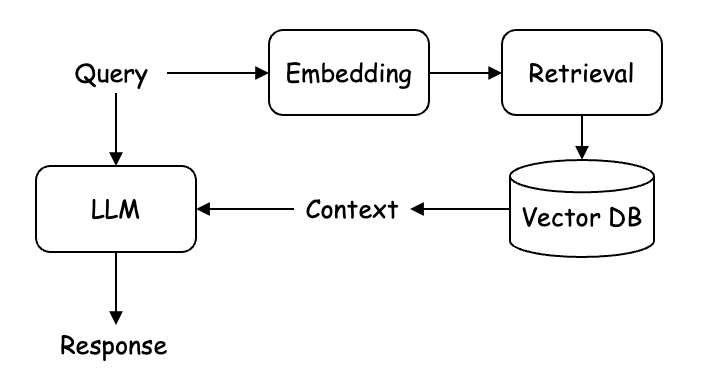

# Unlocking Visual Insights: Building an Image Question Answering System with RAG and LLM



# Prerequisite

Python version 3.9 should work fine.

# Set up

After cloning this repository, open your terminal and follow the steps below:

### Create a virtual environment

```bash
python3 -m venv venv
source venv/bin/activate
```

### Install poetry

Install the poetry library used to manage package dependencies.

```bash
pip install poetry
```

### Install package dependencies

Use poetry command to install the dependencies defined in `pyproject.toml`.

```bash
poetry install
```

### Create dot-env file

Create a file name `.env` and define the following variables using your values.
These values are needed to run the app in the notebook.

```bash
DB_CONNECTION_STRING=postgresql://localhost:5432/postgres?user=postgres
OPENAI_API_KEY=<YOUR_OPENAI_API_KEY_FROM_YOUR_OPENAI_USER_SETTING_PAGE>
```

### Run notebook

Let's open the notebook and try it out!

```bash
jupyter lab notebooks/image-rag-llm.ipynb
```

### Reference for image data
The sample infographics data used in this repository were developed by the CDC and can be downloaded for free at [their website](https://www.cdc.gov/globalhealth/infographics/default.html).
